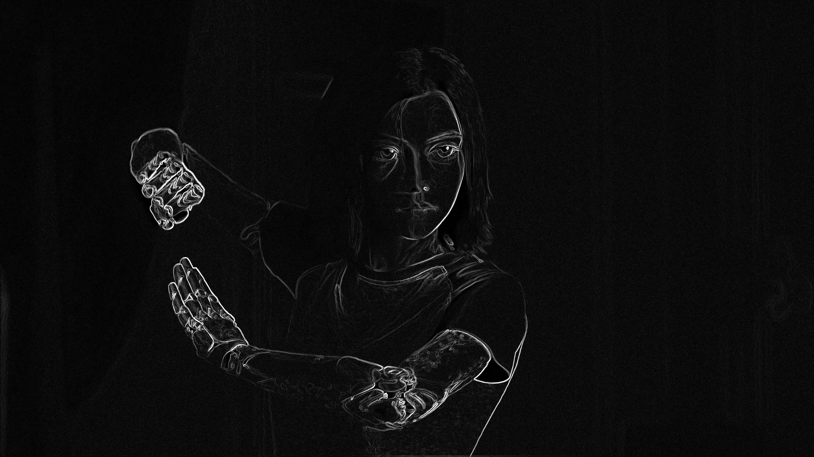
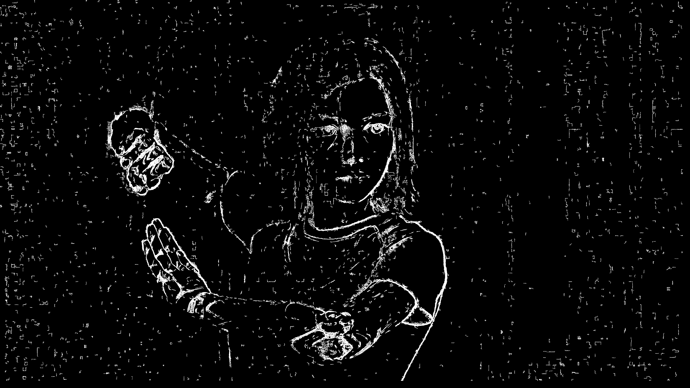

# modified-sobel-edge-detector-version2

This software processes the sobel result and creates a binary image with only the relevent edges. 
You need opencv installed to compile this code. to compile the code type the below command in the terminal. 
Make sude the terminal current directory has the source code. 

g++ -std=c++17 modified_sobel.cpp `pkg-config --cflags --libs opencv` -O2

The image should be present in the same directory as that of the execuatable. 
To execute the program type 
./a.out -src=examples/alita2.jpg

<b>About version 2</b> 
Version 1 had problem in detecting the edges of pictures where the edges are not that distinct, specially in computer generated images. The version 2 aims to achieve a better result for these kinds of images.

Examples

Original image

Sobel result

Result 
